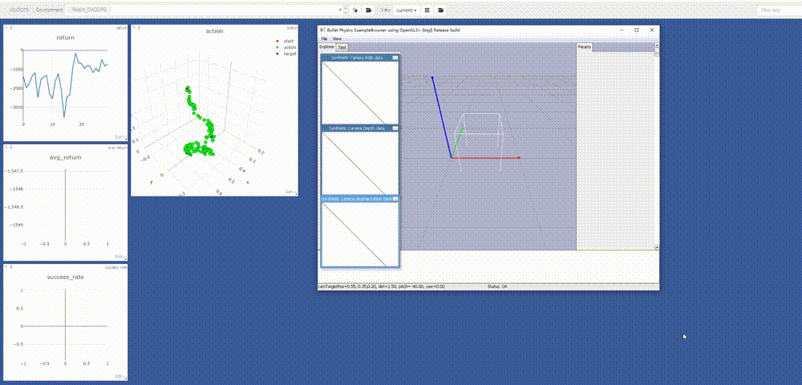
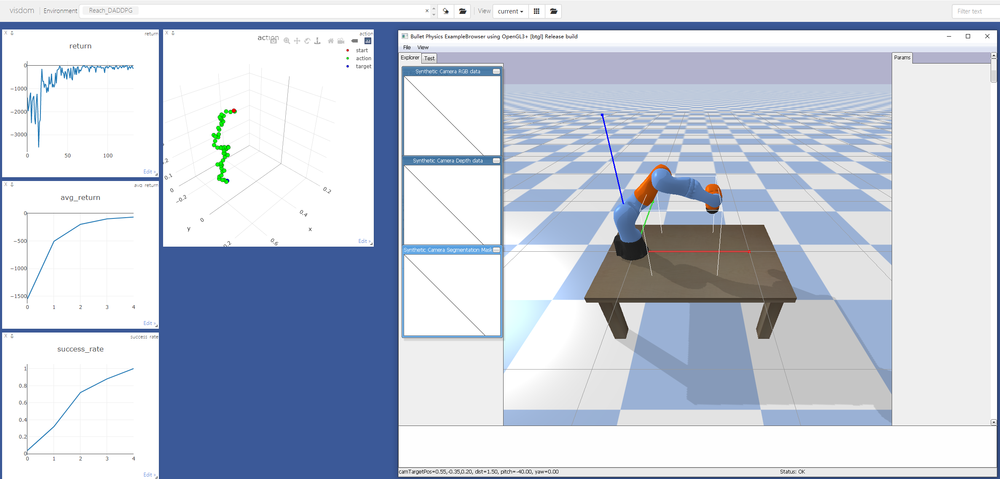
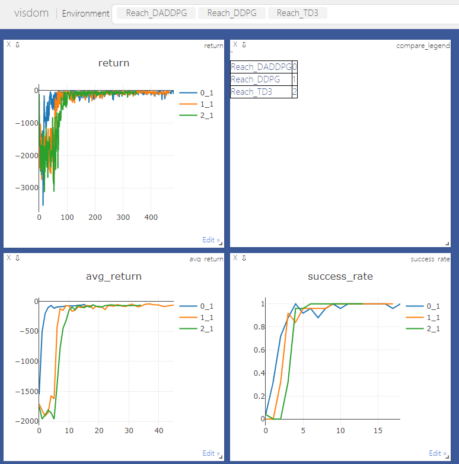

#      Robotic Arm Motion Planning Simulation Based on Reinforcement Learning

 This is the repository of  Robotic Arm Motion Planning Simulation Based on Reinforcement Learning.

## Overview

In this code, I use a self-built pybullet robot arm reinforcement learning environment to test some reinforcement learning algorithms, including `DDPG`, `TD3`, `DADDPG`, `DATD3`, and `DARC`, and try to let the robot arm finish three tasks: reach, push, and pick.

I use `main.py` to run results, the algorithms' parameters are in `config.py`, and use `visdom` to monitor the algorithms' performance. The `envs` deposits three self-built robot arm environments, the `algo` deposits test algorithms, the `models` deposits robot `urdf` file, and the `utils` deposits small tools for rl-learning.

## Requirements

- python: 3.7.11
- mujoco_py: 2.1.5
- torch: 1.6.0+cu101
- gym: 0.19.0
- pybullet: 3.0.6
- visdom: 0.1.8.9

## Test algorithm

- DDPG
- TD3
- DADDPG
- DATD3
- DARC( AAAI 2022, Efficient Continuous Control with Double Actors and Regularized Critics )

## How to use

### Start visdom

```python
python -m visdom.server
```

 Run the following commands to  start visdom server.

### Run simulation

```python
python main.py run --env=<envrionment name> --algo=<algorithm name> --vis_name=<visdom server name> 
```

I use `fire` console to run my code, so use the following commands to run the simulation, you also can change the config in `config.py` instead.

## Some results

### Training process



### Performance



### Online comparison



