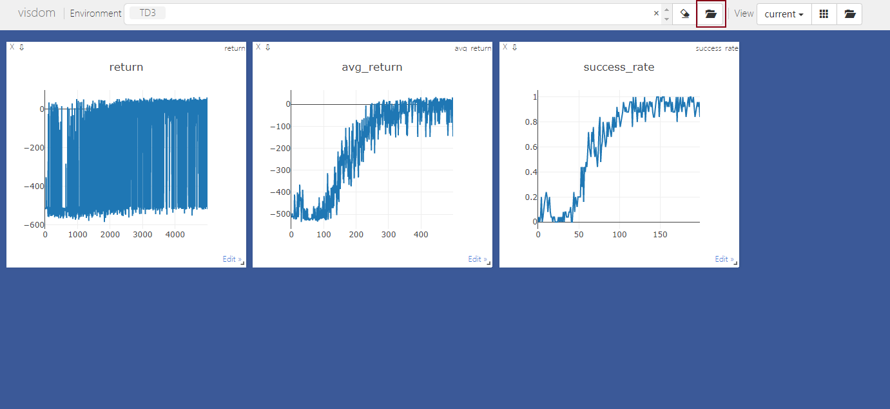
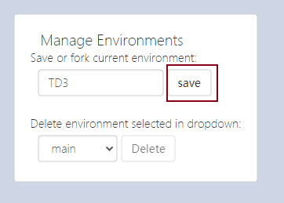
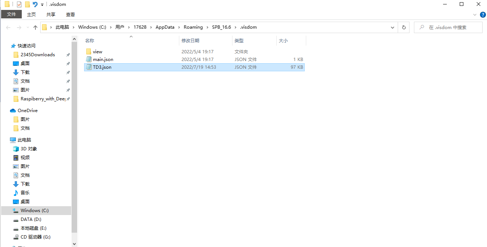

# How to save and use Visdom data

https://zhuanlan.zhihu.com/p/96551613

## Save data

Press save button



Save completed without prompt, and the json file was saved in the default path



the default path is as follows：




## The way to deal with data

```python
vis=Visdom(port=8888)
print(vis.get_env_list())
# 可以得到保存的env list
print(vis.win_exists(win="train",env="main1.0"))
# 可以查看指定win是否存在，此处win不是保存的view的名字，可是代码中指定的win
win_data=vis.get_window_data(win="train",env="main1.0")
# 可以获得指定win数据，即我们想恢复的数据，但是要指定号win和env要不然会是None
# 返回的是str数据，但是其实可以使用json来处理，因为数据本来就是储存在json中的
pre_data= json.loads(win_data)
# 这样就将str转换回dict，可以更方便的处理了
xdata=pre_data["content"]["data"][0]["x"]
ydata=pre_data["content"]["data"][0]["y"]
# 得到横纵轴的数据，是float数据的list
```

or use the code in `main.py` by the following commands:

```python
python main.py get_vis_data --jsonfile=<json file dir> --csvname=<save dir>
```

